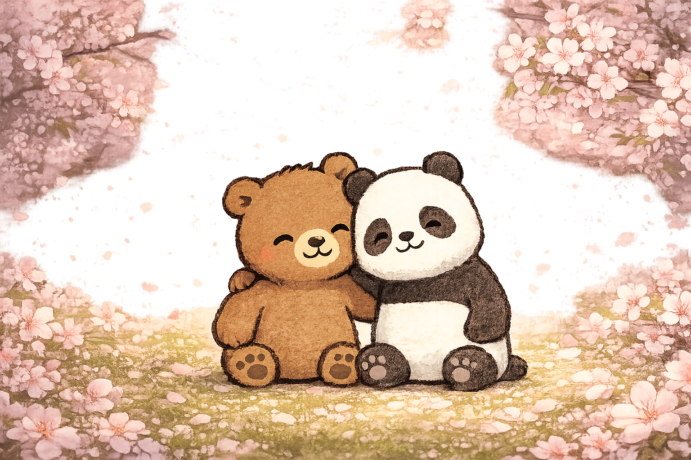

# 🐼 Panda & Bear

## Third-Person Maze Adventure

Panda & Bear is a third-person maze adventure game built in Unity.

The project focuses on creating a small playable game experience around exploration, navigation, character control, and maze-based gameplay.

---

## 🎥 Gameplay Demo

### Panda & Bear

https://youtu.be/YOzdb8wNk0Y?si=s-BPPZmSfAtS1Wul

---

## 🎮 Download & Play

Download the playable **Panda & Bear** build from Google Drive:

https://drive.google.com/drive/u/2/folders/1qpNMennnmYcf_hz1FNkKU3aarFaoMTBS

## 🌐 Portfolio

Full project breakdown, screenshots, development information, and additional details:

https://kaushal-portfolio-liart.vercel.app/Projects/panda-bear

---

# Project Overview

Panda & Bear was created as a third-person adventure experience centered around navigating a maze environment.

The project gave me an opportunity to work on the gameplay systems required to turn a basic 3D environment into a playable experience, including character movement, camera behavior, exploration, and environmental navigation.

The project was also an opportunity to work with a different type of gameplay compared to my more systems-heavy projects such as multiplayer networking, AI frameworks, and custom vehicle physics.

---

# Gameplay

The player explores a maze environment from a third-person perspective.

The core gameplay focuses on:

- Third-person character control
- Maze exploration
- Environmental navigation
- Camera control
- Character movement
- 3D gameplay presentation
- Exploration-focused gameplay

The objective is to navigate through the maze while controlling the character from a third-person perspective.

---

# Technical Focus

The project provided experience with several areas of Unity gameplay programming:

- Third-person character control
- Camera systems
- 3D movement
- Player input
- Collision and environment interaction
- Maze-based level navigation
- Character presentation
- Unity gameplay architecture

---

# Third-Person Controller

The player character is controlled from a third-person perspective, requiring the character's movement and camera behavior to work together.

The controller is responsible for translating player input into movement while maintaining a suitable relationship between the character and the camera.

This creates the foundation for navigating the maze and interacting with the environment.

---

# Camera

The third-person camera provides the player with an external view of the character while navigating the maze.

Camera behavior is an important part of the gameplay because the player needs to be able to understand the surrounding environment and navigate through the maze without losing awareness of their character.

---

# Maze Exploration

The maze provides the main environment for gameplay.

The level design creates an exploration-focused experience where the player has to navigate interconnected paths and understand their surroundings to progress.

The maze also provides a simple environment for testing character movement, camera behavior, collision, and general third-person gameplay.

---

# Development Focus

Unlike some of my other projects, Panda & Bear was primarily focused on creating a complete playable gameplay experience rather than developing a large reusable technical framework.

The project helped me practice taking individual Unity systems and combining them into an actual playable game.

This included connecting:

~~~text
Player Input
      ↓
Character Controller
      ↓
Character Movement
      ↓
Camera
      ↓
Maze Environment
      ↓
Playable Experience
~~~

---

# Technical Challenges

### 1. Third-Person Movement

Creating responsive character movement while maintaining a consistent third-person camera perspective.

### 2. Camera & Character Relationship

Making the camera provide a useful view of the environment while keeping the player character readable and controllable.

### 3. Maze Navigation

Creating an environment where movement and camera behavior work together without making navigation confusing.

### 4. Gameplay Integration

Combining character control, camera behavior, environment interaction, and level design into a complete playable experience.

---

# What I Learned

This project helped strengthen my understanding of the fundamentals required to build a third-person game in Unity.

It provided practical experience with:

- Character controllers
- Third-person cameras
- Player input
- 3D movement
- Collision
- Environmental navigation
- Unity gameplay scripting
- Combining multiple gameplay systems into a complete experience

It also reinforced an important part of game development: individual systems only become useful when they work together to create a coherent player experience.

---

# Technologies

- Unity
- C#
- 3D Gameplay
- Third-Person Controller
- Third-Person Camera

---

# Repository Contents

This repository contains the scripts and programming work associated with Panda & Bear.

The complete Unity project is not included because the full project contains additional assets and project files.

The repository is primarily intended to showcase the **gameplay programming and Unity development** behind the project.

---

# Links

### 🌐 Portfolio

https://kaushal-portfolio-liart.vercel.app/Projects/panda-bear

### 🎥 Gameplay Demo

https://youtu.be/YOzdb8wNk0Y?si=s-BPPZmSfAtS1Wul

## 🎮 Download & Play

Download the playable **Panda & Bear** build from Google Drive:

https://drive.google.com/drive/u/2/folders/1qpNMennnmYcf_hz1FNkKU3aarFaoMTBS
